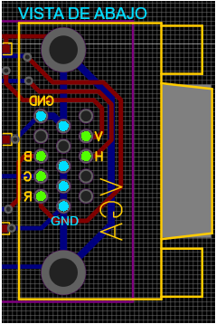
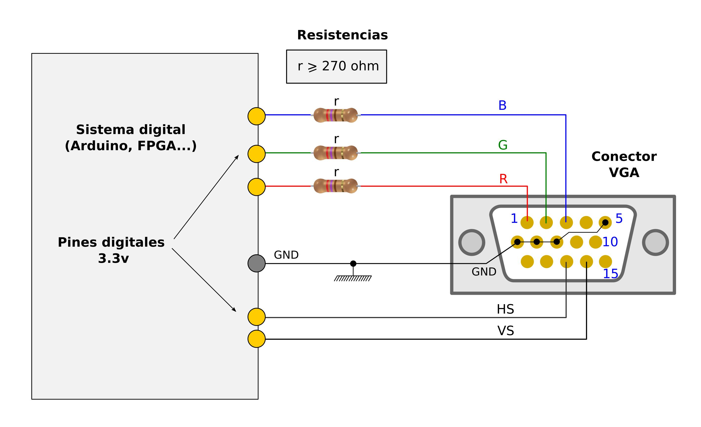
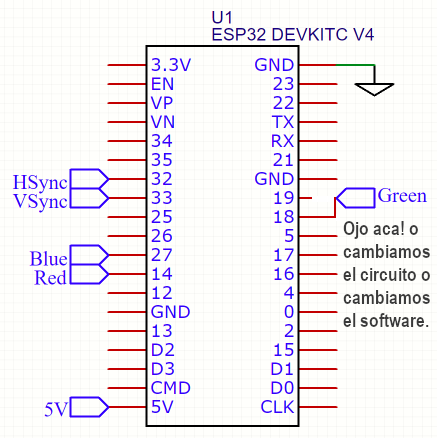

# Esp32Video 6 bits Test

bitluni test para 6 bits

### Usar estos colores en los cables del monitor:

|Nombre|Color|GPIO|
|-|-|-|
|R|Rojo|18|
|G|Verde|14|
|B|Azul|27|
|VSync|Amarillo|33|
|HSync|Naranja|32|
||||
|+12V|Rojo grueso||
|GND|Negro||

- El monitor soporta 15K-80K (?)
- Y esta seteado en 720x403

### Uso la lib de bitluni:

https://github.com/bitluni/ESP32Lib

